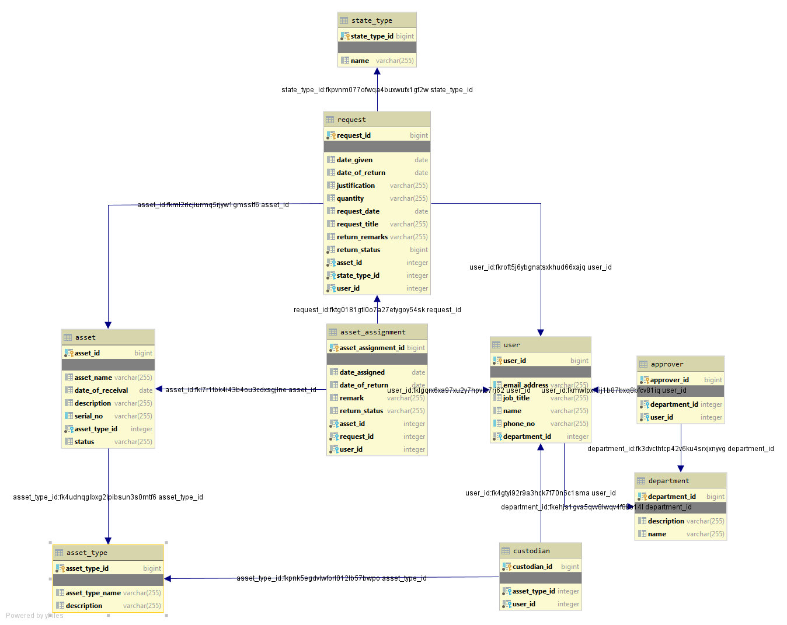

#StepTestManagement

##Description

The Safaricom ET test management system back end is a Java application that provides a RESTful API for managing test data management.

The system is implemented using the following technologies:

    Java 17+
    Spring Boot
    Hibernate
    Maven
    postgres

##Data model

##Installation

Clone the repository:

        

Navigate to the project directory:

    cd java-factorial-project

##Build the project using Maven:

    mvn clean install

##Running the program

To run the program, you can use the following command:

    java -jar StepTestManagement-0.0.1-SNAPSHOT.jar

This will run the program .

##Contact

If you have any questions or feedback, please contact me at eyob.amare@partner.safaricom.et.

###Known Issues

    only a single asset per request is supported.

###Future Improvements

    Add unit tests.
    Improve the performance of the program.
